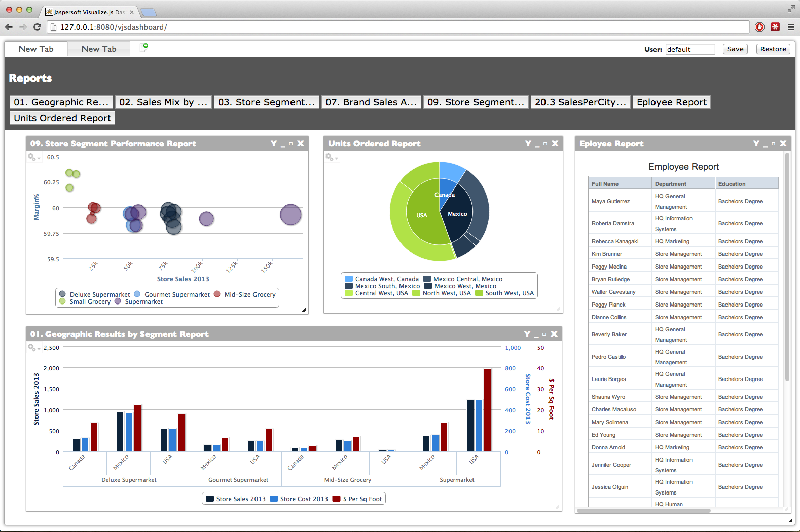

Dashboard Designer for JasperReports Server
===========================================

This is an example dashboard builder showcasing TIBCO Jaspersoft's new Visualize.js Framework. This framework allows users of JasperReport Server to easily write their own web applications that include resources from JRS. You can find more information about Visualize.js at http://community.jaspersoft.com/project/visualizejs

You will need to use the commercial edition of Jaspersoft to be able to use Visualize.js. If you don't have that yet, you can download the Trial Edition at http://community.jaspersoft.com/download

And this is how it looks like in action:

Features
--------

- Drag & Drop reports onto a dashboard, then move & resize them at will
   - Note: You can have several instances of the same report on a dashboard and then set different input parameter values for them (see below).
- Create several tabs, each with its own dashboard
- Set values for report input parameters (click the 'Y' in the report header)
   - Note: As of now, not all input parameter types are supported.
- Save and restore the current state of *all* dashboards (including report input parameters)

Configuration & Deployment
--------------------------

This application consists of two parts: A web application (under `client/`) and a Java servlet (under `server/`). The client contains all the HTML, CSS and JavaScript code for running the dashboard designer in your web browser, while the Java servlet allows you to save a dashboard arrangement in your database (and restore it from there as well!). It is possible to run the client without the server (but then you don't get to preserve your beautiful creations and have to do it all over again).

To get everything up and running follow these simple steps:

1. Locate your installation of JasperReports Server (the so-called <js-install>). The default locations are:
    - Windows: `C:\Jaspersoft\jasperreports-server-5.6`
    - Linux: `<USER_HOME>/jasperreports-server-5.6`
    - Linux (as root): `/opt/jasperreports-server-5.6`
    - Mac OS X: `/Applications/jasperreports-server-5.6`
2. Create two folders in `<js-install>/apache-tomcat/webapps`: `vjsdashboard` and `dashboardsaver`.
3. Copy the contents of `client/` into `vjsdashboard`.
4. Copy the contents of `server/` into `dashboardsaver`.
5. **Take a look at the two configuration files, and adjust the values if necessary:**
    - For the client: `vjsdashboard/scripts/config.js`
    - For the server: `dashboardsaver/WEB-INF/web.xml`
6. Restart JasperReports Server
7. If you are using the default `folderUri` provided in the client configuration, download [this ZIP file](https://github.com/GeneArnold/Dashboard-Example-using-Jaspersoft-Visualize.js-API/raw/master/JasperServerResources/dashboard_reports.zip) (Thanks, [Gene](https://github.com/GeneArnold)!) and import it into JasperReports Server:
    1. Log in to the server with `superuser`.
    2. Go to `Manager -> Server Settings -> Import`.
    3. Click `Choose file` and select the downloaded ZIP file.
    4. Click `Import` (bottom of the page).
7. Point your web browser to `<server>/vjsdashboard` (e.g. `http://127.0.0.1:8080/vjsdashboard`). **Don't use `localhost`, use `127.0.0.1`!**

